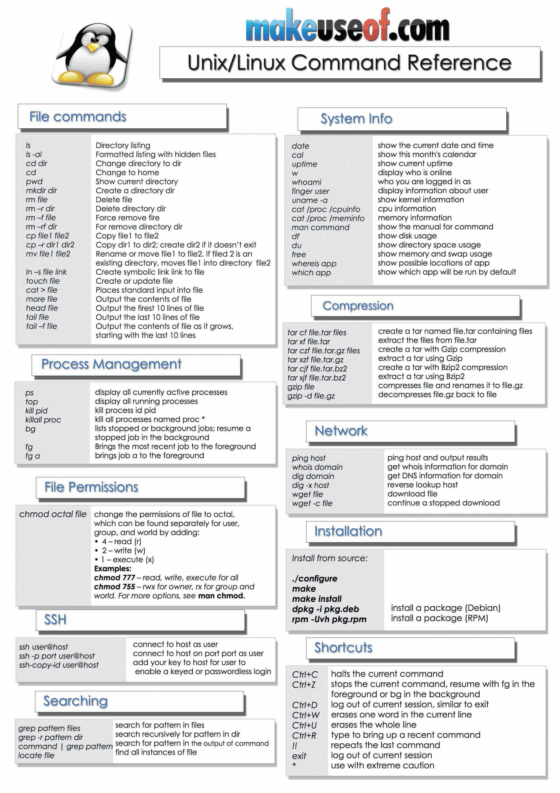
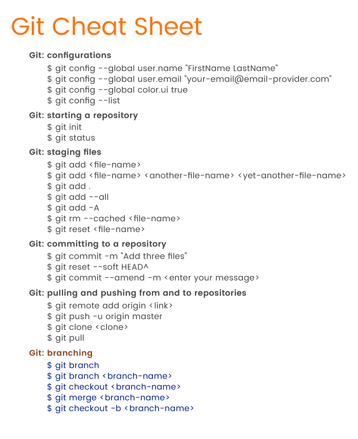
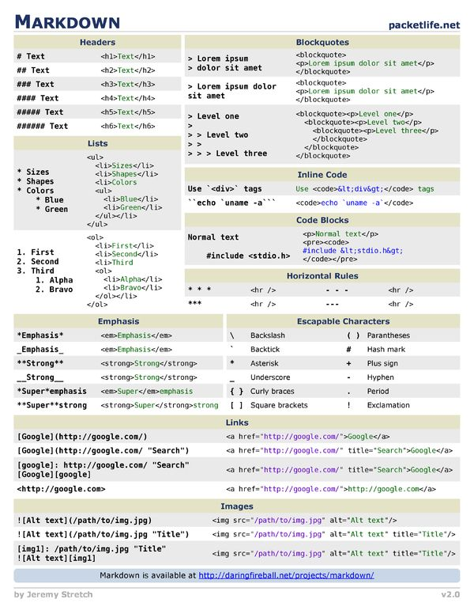

<!--- Calendar iframe goes below --->
<iframe src="https://calendar.google.com/calendar/embed?src=flatironschool.com_nmuuv9qmvss38luac0gvnch44g%40group.calendar.google.com&ctz=America%2FNew_York" style="border: 0" width="800" height="600" frameborder="0" scrolling="no"></iframe>

<details>
<summary style="font-weight:bold;">Getting Started Videos</summary>
  
# Getting Started Video Playlist
This playlist is meant to show you
- Getting Started 00 -> Discusses how to download and install Anaconda for Mac
- Getting Started 01 -> Discusses how to organize your work for the DS program
  - This is really helpful to prevent clutter, but it isn't mandatory
- Getting Started 02 -> Walks you through setting up your **learn-env** virtual environment
- Getting Started 03 -> Walks you through the learn to github to local workflow that you'll use **every day**


<iframe width="853" height="480" src="https://www.youtube.com/embed/videoseries?list=PLj2HyUAn9lEmGc4FIasxTQ2S0JAgYttAD" 
frameborder="0" allow="accelerometer; autoplay; encrypted-media; gyroscope; picture-in-picture" allowfullscreen></iframe>

</details>

# CheatSheets
<details>
  <summary>Terminal Cheatsheet</summary>
 
</details>

<details>
  <summary>Git Cheatsheet</summary>
  
</details>

<details>
  <summary>markdown Cheatsheet</summary>
  
</details>


## Common Commands

**Steps to push your changes to your repo**

```
cd path/to/repo

git add .

git commit -m "your message here"

git push
```

<details>
<summary style="font-weight:bold;">Common Terminal Commands</summary>


|command | command will |
| -------| -------------| 
| ls     | list all files in directory | 
| cd     | change directory | 
| mkdir  | create a new directory | 
| cd ..  | will change directory to parent directory |
|        | (the directory above your current directory |
| jupyter notebook | opens jupyter notebook in current directory | 

</details>


<!--- Pair Programming Section --->
## Pair Programming Partners
This section will be filled out when we get into pair programming. 

Procedures:
* Person 1 is always host
* Person 1 always fills out form
* Do the section project (unless discussed with partner(s))
* For now: Person 1 drives, other people steer

| Section Number| Person 1 (host) | Person 2 | Person 3|
| --------------| ----------------| ---------| --------|
|3-4|student4|student1|None|
|3-4|student2|student5|None|
|3-4|student6|student3|None|
|||||
|5-6|student6|student3|None|
|5-6|student4|student1|None|
|5-6|student2|student5|None|
|||||

<!--- paste pair programming table above --->

<!--- Resources Section --->

## Resources 
[**1 on 1s with instructor-name-here - Instructor**](https://go.oncehub.com/AmberOfficeHours)

[**1 on 1s with edcoach-name-here - Education Coach**](https://darapaoletti.youcanbook.me)

[**About Me Survey** Please take this Prior to Day 1](https://forms.gle/SJWWi5WJQsGRBitSA)

[**Student Services Email** - studentservices@flatironschool.com](mailto:studentservices@flatironschool.com)

[**Video Recording Spreadsheet Link**](https://docs.google.com/spreadsheets/d/1CNGDhjcQZDRx2sWByd2v-mgUOjy13Cd_hQYVXPuzEDE/edit#gid=0)

[**Code Cheat Sheets**](https://drive.google.com/file/d/1_GC4Q672T2H3LuvThj9KusJvFBeQP4Oj/view?usp=sharing)

[**Study Group Github Repo**](https://github.com/Amberlynnyandow/study-group-content)


<!--- Video Resources --->

## Video Resources
|Topic| url |
|-----|-----|
|git commands|[https://www.youtube.com/watch?v=5HLst694D_Y](https://www.youtube.com/watch?v=5HLst694D_Y) | 
|more git support|[https://www.youtube.com/watch?v=I9MttnPfrDw](https://www.youtube.com/watch?v=I9MttnPfrDw) | 


## Study Group Recordings


## Welcome Week Recordings
| Event | recording url |
|-------|---------------|
|Day 1 - Orientation | |
|Day 2 - Meet Your Classmates| |
|Day 3 - Community Talk | |
|Day 4 - Hi From Career Services| |
|Day 5 - Stress Less | |

<!----- Below are all of the Mod Project Rubrics in a tablel--->


## Program Guide
[Click here](https://help.learn.co/online-immersive-bootcamps/what-if-i-cant-keep-up-with-my-cohort)
